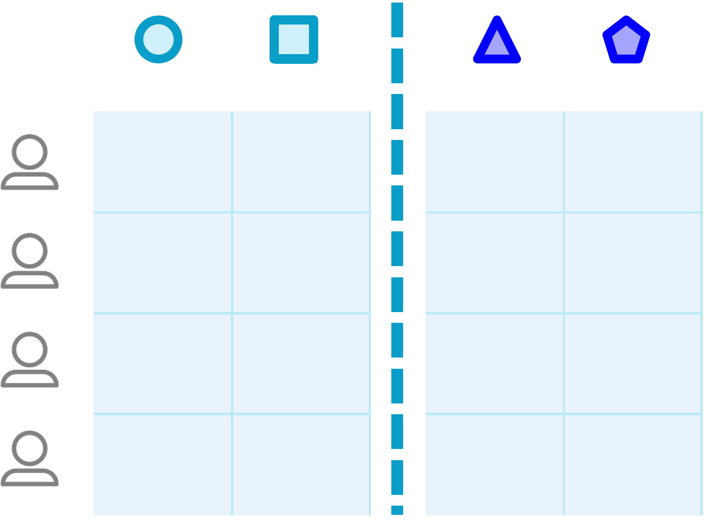

# VERTIGO
Explanation and (local) implementation of the VERTIGO algorithm (logistic regression for vertically-partitioned data) in Python.

----

Federated learning (FL, also known as distributed learning) algorithms try to learn a global model using data from different sources without data ever leaving their original location. Furthermore, no raw (patient) sensitive data are shared between any of the parties. In other words, instead of bringing the data to the algorithms, we bring the algorithms to the data.

In this repository, we explain the VERTIcal Grid lOgistic regression (VERTIGO) model for DL of vertically-partitioned data. The latter refers to the condition in which each party owns a portion of the (clinical) variables of the same group of instances (in our case, patients; Fig. 1). We also show an example simulating a distributed scenario.

Fig. 1. Representation of vertically-partitioned data. In this case, the involved parties have different features for the same instances (i.e., patients).

## [_Understanding_ VERTIGO](https://nbviewer.jupyter.org/github/IKNL/vertigo/blob/master/scripts/demo_vertigo.ipynb)
In this notebook we provide a step-by-step explanation of how VERTIGO works and how we implemented them. We also include a few tweeks that we needed to do to get VERTIGO running that aren't explicitely mentioned in the paper.

## [_Using_ VERTIGO (locally)](https://nbviewer.jupyter.org/github/IKNL/vertigo/blob/master/scripts/demo_vertigo_local.ipynb)
Although VERTIGO is intended to be used in a distributed scenario, in this notebook we simulate it locally for ease of understanding. Namely, we perform a logistic regression analysis in a dataset in a centralized way and in a (simulated) distributed way using VERTIGO. Then, we compare the resulting coefficients of both approaches. For a real-life distributed implementation of VERTIGO using our [privacy preserving DL infrastructure](https://github.com/IKNL/ppDLI), see our other repository, `d_vertigo`.

----

###### Disclaimer
Please note that VERTIGO was originally proposed in the paper

> [Li, Yong, et al. "Vertical grid logistic regression (vertigo)." Journal of the American Medical Informatics Association 23.3 (2015): 570-579](https://academic.oup.com/jamia/article/23/3/570/2908996).

If you use the presented implementation of VERTIGO, please cite the original paper as well as this repository using its DOI. 
